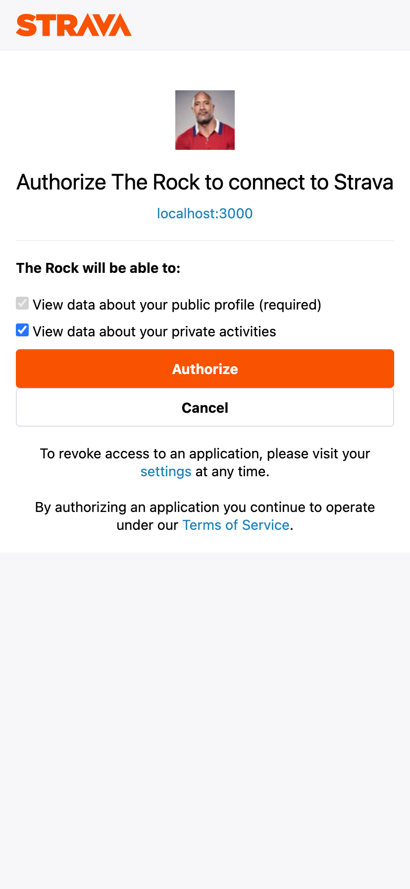

## Project Objective

Marathon Buddy was a chance to explore new and dificult technologies at Prime Digital academy. Since I want to start businesses in the future, I wanted to explore payments, user auth, Oauth 2, and email for the project. Marathon Buddy is an athletic training gamification app that allows users to stake money in order to meet their athletic goals. 

Elevator pitch: Training for a marathon is hard, and even harder doing it alone. Training can start up to 6 months before race day, and it can be difficult to find motivation during that extended period of time. Marathon Buddy was built to gamifying that experience by first having the user join a cohort (group) of other runners and then putting money on the line (that they can lose) if they don't meet their training goals. 

[Deploy Link 🚀](http://www.marathonbuddy.co) ! Link will take ~10s to boot-up !

| Marathon Buddy Walk-Through! |
|:---:|
| |
| Home |
| This page explains what Marathon Buddy is all about! First page the user sees when they go to www.marathonbuddy.co |
|  |
| |
| Login / Register |
| Users can sign up for an account / login. Registration will have the user verify their email through an email link. |
|  |
| |
| Connect To Strava |
| Strava is a GPS tracking platform that syncs data from fitness-devices such as Garmin, Apple Watch and FitBit. This page will allow the user to connect their Strava account to Marathon Buddy. We will use this as the source of truth to know if the user is completing their trainings or not. |
|  |
| |
| Strava Authorization |
| When the user clicks the Connect button on the previous screen, they are taken to Strava.com. They will login, then click "Authorize" to allow Marathon Buddy to keep track of their running activities for them. |
|  |
| |
| Duration Choice |
| The user will have 4 options to choose from for how long they would like to train: 1 week, 2 weeks, 1 month and 2 months. Clicking on one of the cards will take them to the next page. |
|  |
| |
| Decide Training Days |
| The user will decide which days they would like to train within the contrainsts of the training duration that they chose. |
|  |
| |
| Decide Stake + Mileage For Training Days |
| This page gives the user more information about the cohort that they will be joining. They can also decide the daily stake amount ($) that they would like to put on the line. And finally, the user will plan the mileage for each day that they chose to train. |
|  |
| |
| Stripe Checkout |
| Where the user will put in their payment details to commit to their training plan. |
|  |
| |
| Current Cohort Dashboard |
| After the user finishes signing up, they can view their planned trainings on this page. They can click on a day from the calendar and get more information about how many miles were planned and how far they actually ran (this screenshot is from the end of a cohort). They can also see personal stats and overall cohort stats like completion percentage and total miles run. |
|  |
| |
| Cohort History Page |
| The user can see their performance through multiple cohorts and see how they are improving over time. |
|  |
| |
| Daily Email Update |
| The user will automatically receive daily email updates with information about the previous days train. This will include: date, miles planned, actual miles run and if they kept their stake or not. |
|  |
| |
| Database Architecture |
| This is the database design that I used for the project. |
|  |
| |

## What I learned

1. How to read API documentation efficiently. Learned the OAuth 2.0 flow with the Strava V3 documenation and how to implement a Stripe webhook for a custom subscription integration. (SendGrid API learned as well)  

2. How to implement database transaction with async await try catch blocks. Since there were many database queries for each endpoint/function, this allows for an all-or-nothing transaction with the database and proper error handling.

3. Handling large functions by refactoring them into smaller function that return a promise with resolve / reject. This allows me to refactor Promise.all and larger endpoints into smaller helper functions.

## What I would add in the future

All the things I would add in the future have to do with making the project more robust. 

Refactored with:
- Type based language such as TypeScript
- Unit tests / Integration testing
- Database query A / B testing for performance
- Global scss variables utilization

## Technologies
* JavaScript
* HTML
* CSS
* SCSS/SASS
* React
* Redux
* Redux-Saga
* Node.js
* Express
* Passport.js
* PostgreSQL
* Material UI
* Strava V3 OAuth 2.0
* Stripe API
* SendGrid API

## Connect with me on LinkedIn! Always interested meeting new people! 

